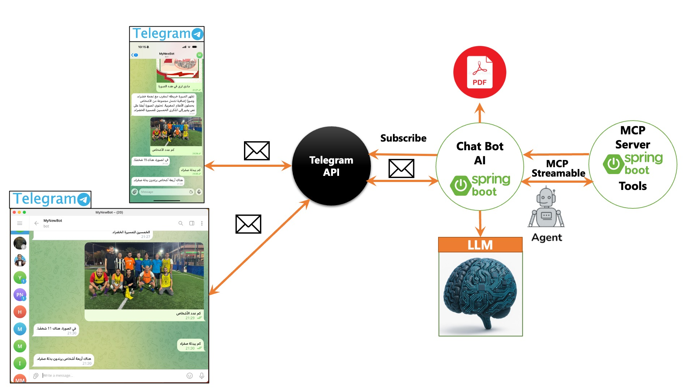

# EBank — Spring Cloud & Agentic AI

## 1. Présentation

EBank est une plateforme bancaire en **microservices Spring Cloud** associée à un **assistant bancaire Agentic AI**.

L'assistant, basé sur **Spring AI** et **GPT-4o**, répond aux questions des utilisateurs depuis **Telegram** ou depuis une
**interface web Angular**. Pour répondre, il :

- interroge les services métier (comptes, clients, employés) via des outils **MCP Streamable HTTP** ;
- recherche les règles et informations de la banque dans une base documentaire **RAG** (PDF, images, audio) stockée dans
  **PostgreSQL + pgvector** ;
- raisonne en plusieurs étapes avec un **Goal** et un cycle **ReAct** borné ;
- conserve le fil de la conversation grâce à une **mémoire** ;
- comprend les **images**, les **messages vocaux** et les **documents PDF** envoyés par l'utilisateur.

L'ensemble démarre avec une seule commande Docker Compose.



## 2. Architecture globale

```
            Utilisateur
         ┌──────┴───────┐
      Angular        Telegram
         │              │
         ▼              │
   API Gateway          │
         │              │
         ▼              ▼
     Ebank Chatbot Service
                │
                ▼
          Agentic AI (GPT-4o)
     Goal · ReAct · Few-shot · Memory
       ┌────────┼─────────┐
       ▼        ▼         ▼
      MCP      RAG      Memory
       │        │
       │        └──► PostgreSQL + pgvector
       ├──► Ebank Service ──OpenFeign──► Customer Service
       ├──► Customer Service
       └──► MCP Server RH

   Discovery Service (Eureka)  ·  Config Service  ·  API Gateway
```

- Tous les services s'enregistrent dans **Eureka** et chargent leur configuration depuis le **Config Server**.
- L'**API Gateway** route les requêtes vers les services découverts dans Eureka.
- L'interface **Angular** appelle `/chatbot/...` ; le serveur Nginx du conteneur `frontend` relaie ces appels vers la Gateway.
- **Telegram** communique avec le chatbot en long polling.

## 3. Microservices

| Service | Port | Rôle |
|---|---|---|
| `discovery-service` | 8761 | Annuaire Eureka des services |
| `config-service` | 8888 | Configuration centralisée (Spring Cloud Config, dépôt `native` : `config-repo`) |
| `gateway-service` | 8080 | Point d'entrée unique, routage via Eureka |
| `customer-service` | 8066 | Clients de la banque (REST) + serveur MCP |
| `ebank-service` | 8077 | Comptes bancaires (REST, H2) + serveur MCP + client OpenFeign vers Customer |
| `mcp-server` | 8989 | Serveur MCP RH (employés) |
| `ebank-chatbot-service` | 8098 | Assistant Agentic AI : agent, ReAct, RAG, multimodal, Telegram, API de chat |
| `frontend` | 4200 | Interface web Angular servie par Nginx |
| `postgres` | 5433 (hôte) / 5432 (réseau Docker) | PostgreSQL 17 + pgvector, base vectorielle du RAG |

Le service `ebank-chatbot-service` correspond au projet Maven situé à la racine du dépôt.

## 4. Spring Cloud

| Composant | Mise en œuvre |
|---|---|
| **Eureka / Discovery** | `@EnableEurekaServer` ; chaque service s'enregistre sous son nom (`EBANK-SERVICE`, `CUSTOMER-SERVICE`...) |
| **Config Server** | `@EnableConfigServer` ; un fichier par service dans `config-repo` + un fichier commun ; les clients utilisent `spring.config.import=configserver:...` |
| **API Gateway** | Spring Cloud Gateway : `/ebank/**`, `/customers/**`, `/chatbot/**`, `/mcp-rh/**` vers `lb://NOM-EUREKA` ; CORS pour l'interface Angular |
| **OpenFeign** | `@FeignClient(name = "CUSTOMER-SERVICE")` dans Ebank : `GET /bankAccounts/{id}` renvoie le compte et son propriétaire |

## 5. Agentic AI

L'agent suit le modèle **Agent = Mind + Body**.

| Élément | Mise en œuvre |
|---|---|
| **LLM** | GPT-4o via Spring AI (`ChatClient`) |
| **Message système** | Objectif, méthode et règles : ne jamais inventer de donnée bancaire, utiliser les outils, citer les sources, gérer l'information indisponible et les demandes hors domaine |
| **Few-shot** | 7 exemples de démarche (compte, propriétaire, comptage, frais, compte + règle, sources multimodales, document PDF fourni) |
| **Goal** | Pour chaque requête, un objectif et un critère de réussite définis à partir de la demande, des outils disponibles et du contenu fourni |
| **ReAct** | `ReActAdvisor` : boucle Reasoning → Action → Observation → évaluation du Goal, limitée à 5 itérations (`react.max-iterations`) |
| **Memory** | `MessageChatMemoryAdvisor` : les derniers messages de la conversation sont renvoyés au modèle |
| **Outils** | 6 outils MCP + l'outil RAG `searchBankDocuments` |

### Cycle ReAct

```
Goal ─► Reasoning (GPT-4o) ─► Action (outil MCP / RAG) ─► Observation ─► Évaluation
                    ▲                                                         │
                    └──────────── objectif non atteint ◄──────────────────────┤
                                                                              ├─► atteint → réponse finale
                                                                              ├─► information indisponible → réponse sans invention
                                                                              └─► limite d'itérations → réponse contrôlée
```

Exemple : « Qui est le propriétaire du compte X ? »
`getBankAccountById(X)` → observation contenant `customerId` → `getCustomerById(customerId)` → réponse finale.

Chaque étape est tracée dans les logs du chatbot (préfixe `[REACT]`).

## 6. MCP

Le chatbot est **client MCP Streamable HTTP** : au démarrage, il découvre les outils des serveurs (`tools/list`), puis GPT-4o
choisit les outils à appeler (`tools/call`) selon la question.

```
Agent ─► MCP Client ─► POST http://<service>:<port>/mcp ─► MCP Server ─► @McpTool ─► service métier
```

| Serveur MCP | Service | Outils |
|---|---|---|
| Ebank (`account-mcp-server`) | `ebank-service` | `getAllAccounts`, `getBankAccountById`, `saveAccount` |
| Customer (`customer-mcp-server`) | `customer-service` | `getCustomerById` |
| RH (`mcp-rh`) | `mcp-server` | `getEmployee`, `getAllEmployees` |

**OpenFeign** relie deux services par du code Java ; **MCP** expose ces mêmes services à l'agent IA, qui décide lui-même
des appels.

## 7. RAG

```
PDF ─► PagePdfDocumentReader ─► TokenTextSplitter (≈300 tokens) ─► text-embedding-3-small (1536) ─► pgvector (HNSW, cosinus)

Question ─► searchBankDocuments ─► recherche sémantique (top-k 4, seuil 0.45) ─► extraits + sources ─► GPT-4o ─► réponse
```

- Les documents de `src/main/resources/rag/` sont indexés au démarrage du chatbot.
- L'ingestion est **idempotente** : une empreinte SHA-256 par fichier évite les doublons et les recalculs.
- Chaque extrait conserve ses métadonnées : fichier source et empreinte, page pour les PDF, type et modèle utilisé pour les
  images et l'audio.
- L'agent répond uniquement à partir des extraits trouvés et cite les fichiers ; sinon :
  « Information non disponible dans la base documentaire. »

## 8. Multimodal

| Entrée | Traitement |
|---|---|
| **Image indexée** (`rag/images`) | Description fidèle par GPT-4o Vision, découpée par sections thématiques, puis embedding texte dans pgvector |
| **Audio indexé** (`rag/audio`) | Transcription Whisper, puis chunks et embeddings dans pgvector |
| **Image envoyée** (Angular, Telegram) | Jointe au message et analysée par GPT-4o |
| **Audio envoyé** (fichier, micro Angular, note vocale Telegram) | Transcription Whisper, puis traitement comme une question |
| **PDF envoyé** (Angular) | Texte extrait puis fourni à l'agent, qui répond d'après le document |

Les images sont indexées sous forme de **description textuelle** générée par GPT-4o (et non par un embedding d'image de
type CLIP).

## 9. Interfaces

| Interface | Fonctionnement |
|---|---|
| **Angular** | Page de chat : texte, image avec aperçu, PDF, fichier audio, enregistrement micro, affichage de la transcription |
| **Telegram** | Bot en long polling : messages texte, photos avec légende, notes vocales |

API de chat du chatbot (via la Gateway) :

| Entrée | Endpoint | Réponse |
|---|---|---|
| Texte | `GET /chatbot/chat?query=...` | texte |
| Image | `POST /chatbot/chat/image` (multipart `file`, `query` optionnel) | `{ "answer", "transcription": null }` |
| Audio | `POST /chatbot/chat/audio` (multipart `file`) | `{ "answer", "transcription" }` |
| PDF | `POST /chatbot/chat/pdf` (multipart `file`, `query` optionnel) | `{ "answer", "transcription": null }` |

Fichiers limités à 10 Mo.

## 10. Docker

- `docker-compose.yml` démarre **9 conteneurs** sur le réseau `ebank-network`.
- Un `Dockerfile` par service : build Maven avec JDK 21, exécution sur JRE 21 ; build Node puis Nginx pour le frontend.
- Des **healthchecks** ordonnent le démarrage : Discovery → Config → Customer / Ebank / MCP → Gateway / Chatbot → Frontend.
- Dans Docker, les services communiquent par leur nom (`config-service:8888`, `discovery-service:8761`,
  `ebank-service:8077/mcp`, `postgres:5432`...).
- Les vecteurs sont conservés dans le volume `ebank-rag-pgdata`.

### Variables d'environnement

| Variable | Obligatoire | Usage |
|---|---|---|
| `OPENAI_API_KEY` | oui | GPT-4o, embeddings, Whisper |
| `PGVECTOR_PASSWORD` | oui | Mot de passe PostgreSQL / pgvector |
| `TELEGRAM_BOT_TOKEN` | non | Bot Telegram ; sans token, le chatbot démarre sans Telegram |

Aucun secret n'est écrit dans le code, la configuration ou les images : les valeurs sont fournies par l'environnement ou
par un fichier `.env` local (ignoré par Git, modèle : `.env.example`).

## 11. Technologies

| Domaine | Technologies |
|---|---|
| Backend | Java 21, Spring Boot 3.5 |
| Microservices | Spring Cloud 2025.0 : Eureka, Config Server, Gateway, OpenFeign |
| IA | Spring AI 1.1, OpenAI GPT-4o, text-embedding-3-small, Whisper |
| Outils agent | MCP Streamable HTTP (client et serveurs Spring AI) |
| Données | H2 (comptes), PostgreSQL 17 + pgvector (RAG) |
| Interfaces | Angular 19, Tailwind CSS, Telegram Bots |
| Déploiement | Docker, Docker Compose, Nginx |

## 12. Installation et lancement

Prérequis : Docker Desktop, une clé OpenAI, et optionnellement un token de bot Telegram.

```bash
git clone https://github.com/Wis-03/ebank.git
cd ebank
cp .env.example .env        # renseigner OPENAI_API_KEY, PGVECTOR_PASSWORD, TELEGRAM_BOT_TOKEN
docker compose up -d --build
docker compose ps           # tous les conteneurs doivent être "healthy"
```

| URL | Description |
|---|---|
| http://localhost:4200 | Interface Angular |
| http://localhost:8080 | API Gateway |
| http://localhost:8761 | Tableau de bord Eureka |
| http://localhost:8888/ebank-chatbot-service/default | Configuration servie par le Config Server |

Arrêt : `docker compose down` (les données pgvector sont conservées).

## 13. Exemples d'utilisation

Les identifiants de comptes sont générés au démarrage d'Ebank : `GET http://localhost:8080/ebank/bankAccounts` les liste.

| Cas | Exemple | Traitement |
|---|---|---|
| Question simple | « Bonjour » | Réponse directe, sans outil |
| Recherche d'un compte | « Donne-moi les informations du compte `<id>` » | `getBankAccountById` |
| Propriétaire d'un compte | « Qui est le propriétaire du compte `<id>` ? » | `getBankAccountById` → `getCustomerById` |
| Question RAG | « Quelles sont les conditions du compte épargne ? » | `searchBankDocuments`, source citée |
| Image | Photo d'un ticket + « Quel est le montant total ? » | Lecture de l'image par GPT-4o |
| Audio | Message vocal « À quelle heure ferment les agences le samedi ? » | Whisper puis `searchBankDocuments` |
| PDF | Relevé PDF + « Quel est le solde final du relevé fourni ? » | Réponse d'après le document fourni |

```bash
curl "http://localhost:8080/chatbot/chat?query=Bonjour"
curl -F "file=@releve.pdf;type=application/pdf" -F "query=Quel est le solde final du relevé fourni ?" \
     http://localhost:8080/chatbot/chat/pdf
curl -F "file=@question.wav;type=audio/wav" http://localhost:8080/chatbot/chat/audio
```

## 14. Évolution du projet

Le projet a été initialement fourni sous forme d'une base Spring Boot intégrant un chatbot, Spring AI, Telegram, Ebank et
MCP. Cette base a ensuite été étendue et structurée en architecture microservices Spring Cloud, puis enrichie avec Customer
Service, OpenFeign, Agentic AI/ReAct, RAG, traitement multimodal, interface Angular et Docker.
